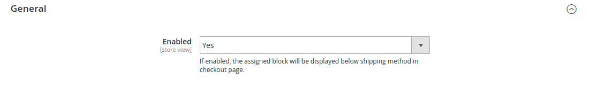

# AdditionalShippingBlock - Magento 2 Module

 - [Main Functionality](#main-functionality)
 - [Installation](#installation)
 - [Configuration](#configuration)


## Main Functionality
This module lets you add a block in the desired placement position within the shipping method on the checkout page.

## Installation
\* = in production please use the `--keep-generated` option

### Type 1: Composer (recommended)

 - Install the module composer by running `composer require sndsabin/module-additionalshippingblock`
 - enable the module by running `php bin/magento module:enable SNDSABIN_AdditionalShippingBlock`
 - apply database updates by running `php bin/magento setup:upgrade`\*
 - Flush the cache by running `php bin/magento cache:flush`

### Type 2: Zip file

 - Unzip the zip file or git clone(```git clone https://github.com/sndsabin/AdditionalShippingBlock.git```) this repo in `app/code/SNDSABIN/`.
 - Enable the module by running `php bin/magento module:enable SNDSABIN_AdditionalShippingBlock`
 - Apply database updates by running `php bin/magento setup:upgrade`\*
 - Flush the cache by running `php bin/magento cache:flush`


## Configuration

### Block


 1. Select Block to be rendered on the checkout page
     - Stores > Configuration > Additional Shipping Block > View Settings > Block > Block
     - select the block to be added above/below the shipping methods on the checkout page.
    
    
    
 2. Select the block placement
  - Stores > Configuration > Additional Shipping Block > View Settings > Block > Block Placement
     - select the position of the selected block to be placed on the checkout page (above or below the shipping methods).
    
    **Default Option: After Shipping Methods**
    
   
 3  Render Selected Block Even if it's not enabled (optional)
  - Stores > Configuration > Additional Shipping Block > View Settings > Block > Render Selected Block If Disabled
  - select the Yes / No Option (If selected Yes, the selected block will be rendered on the checkout page even if the selected block is not enabled.)
  
    **Default Option: No**
    
  
### General



1. Make the selected block visible on the checkout page
  - Stores > Configuration > Additional Shipping Block > View Settings > General > Enabled
  - select the Yes / No Option (If enabled, the assigned block will be visible in the desired position within the shipping method on the checkout page.)

    **Default Option: Yes**
    

## Frontend Checkout Page

#### Block Placement : After Shipping Methods


#### Block Placement : Before Shipping Methods


#### Template css class
There are two classes added to the div element in the template ```additional-shipping-block-container``` and ```additional-shipping-block-content``` if in case you need to use it.


## License
[GPL](LICENSE)

##### Uppercase Vendor Name 😛 ?
Yes 😄

**Bootstrapped using [Mage2Gen](https://mage2gen.com). Inspired from [magento2-module-additional-shipping-block](https://github.com/sohelrana09/magento2-module-additional-shipping-block).**
